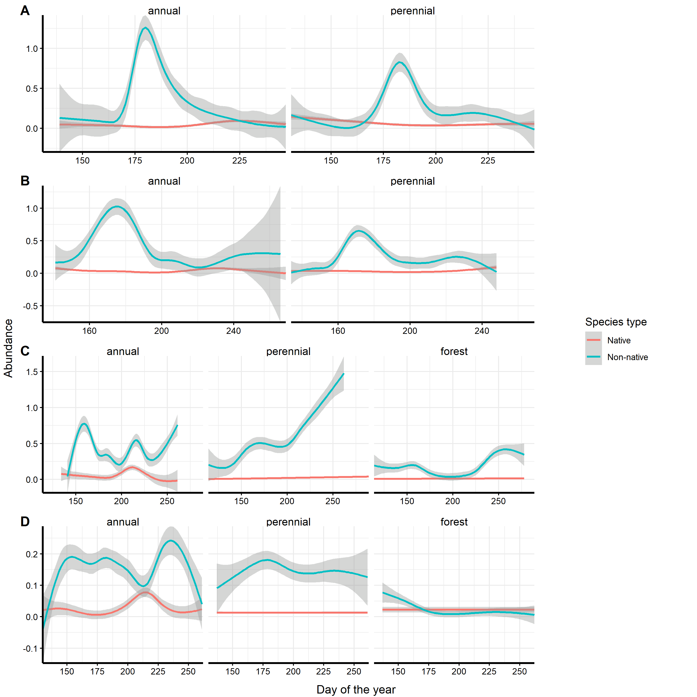

# Project Info

**Date**: April 6th, 2021

**Group members:**

Amanda Zacharias (20043354)

Arjun Augustine (20060723)

Alexander Row (20067626)

Yudong Liu (20020036)

Cameron MacPhail (20012451)

## Dataset Description 
  The dataset selected for this project was originally published by [Bahlai et al. (2014)](https://link-springer-com.proxy.queensu.ca/article/10.1007/s10530-014-0772-4#Sec2) and used data from a multi-year study conducted on a ladybeetle (Coccinellidae) community in southwestern Michigan. The study aimed to elucidate the mechanism behind the decline of native Coccinellidae species and generate potential conservation strategies. 
  Data were collected in southern Michigan on an experimental farm and forest area. Forest sampling began in 1993, so data before this time does not include the forest community classification. Adult coccinellids were captured using un-baited yellow sticky pads suspended in the air. As this sampling technique may be more efficient in some habitats than other habitats, we will focus our analysis within habitat types to minimize bias. The time period covered by this dataset includes several important ecological events, including the introduction of non-native competitors (alien coccinellid species) and prey (soybean aphids).
	The first, second and third variables describe collection dates in the form of year; day, month and year (DD-Month-YYYY); and ordinal day of the year, respectively. The fourth variable describes how the plot was managed (e.g. conventional tilling, organic, etc.), if at all. The fifth variable records the habitat type (i.e. the plant community growing in the plot). This differs from the management treatment due to crop rotation. The sixth variable is the plant community classification (annual, perennial, or forest). The seventh variable is the plot replicate number. The eighth variable is the sample station number; there are five stations per plot. The ninth variable is the species ID; there are 13 species in total. Finally, the tenth variable describes the total number of adults captured in a subsample during a week. See Table 1 for a better understanding of the variables within the dataset.
	Bahlai et al. (2014) concluded that the decreasing abundance of native Coccinellidae species was due to competitive exploitation driven by dietary overlap with alien Coccinellidae species. Our project will examine whether seasonal niche partitioning is occurring among and between native and non-native coccinellids.
	
There are 13 species of Ladybeetle documented in this study. 9 species are native, while the remaining 4 are non-native invase species. 


## Native species

1. Two Spot ladybird - [Adalia bipunctata](https://en.wikipedia.org/wiki/Adalia_bipunctata)
{width=30%}


2. Spotted Lady Beetle - [Coleomegilla maculata](https://biocontrol.entomology.cornell.edu/predators/Coleomegilla.php) 
{width=30%}


3. Twice stabbed ladybug - [Chilocorus stigma](https://www.discoverlife.org/mp/20q?search=Chilocorus+stigma)
{width=30%}


4. Three-banded ladybeetle - [Coccinella trifasciata](https://www.discoverlife.org/mp/20q?search=Coccinella+trifasciata)
{width=30%}


5. Polished/spotless ladybeetle - [Cycloneda munda](https://bugguide.net/node/view/472564)
{width=30%}


6. Convergent ladybeetle - [Hippodamia convergens](https://en.wikipedia.org/wiki/Hippodamia_convergens)
{width=30%}


7. Glacial ladybeetle - [Hippodamia glacialis](https://www.discoverlife.org/mp/20q?search=Hippodamia+glacialis)
{width=30%}


8. Parenthesis ladybeetle -[ Hippodamia parenthesis](https://www.discoverlife.org/mp/20q?search=Hippodamia+parenthesis&guide=Ladybug&cl=llp)
{width=30%}


9. Thirteen-spot ladybeetle - [Hippodamia tredecimpunctata](https://www.jungledragon.com/specie/13740/thirteen-spot_ladybird.html)
{width=30%}


## Non-native Invasive Species

1. Seven-spot ladybeetle - [Coccinella septempunctata](https://kids.kiddle.co/Coccinella_septempunctata)
{width=30%}


2. Harlequin/Asian ladybeetle - [Harmonia axyridis](https://davesgarden.com/guides/bf/go/4139/#b)
{width=30%}


3. Variegated ladybeetle - [Hippodamia variegata](https://bugguide.net/node/view/352609)
{width=30%}


4. 14-spotted ladybeetle - [Propylea quatuordecimpunctata](https://www.inaturalist.org/taxa/61532-Propylea-quatuordecimpunctata)
{width=30%}


**We seek to address the following questions:**

*1. Within sampling years, does native and non-native species abundance change according to the month?*

- So should we move the temporal abundance stuff Cameron did up in the document? It might make sense to present all his findings first (which address all 3 question), then have the tree stuff as an alternate way we tried to test questions 2 & 3.

2. Is there temporal niche partitioning among native species and among non-native species? Is there temporal niche partitioning between native and non-native species?

3. Is there a change in seasonal partitioning before and after invasive species arrive?

\n 

**Hypotheses for each question: ** 

1. **H0**: Native and non-native species abundance does not change according to the month within sampling years. **H1**: Native and non-native species abundance does change according to the month within sampling years. We suspect that native and non-native species abundance will change according to month because abundance may be impacted by environmental factors that vary seasonally. 

2. **H0**: There is no temporal niche partitioning among native species and among non-native species. There is no temporal niche partitioning between native and non-native species. **H1**: There is temporal niche partitioning among native species and among non-native species. There is temporal niche partitioning between native and non-native species. We suspect that there will be temporal niche partitioning because native and non-native species may compete. 

3. **H0**: There is no change in seasonal partitioning before and after invasive species arrive. **H1**: There is a change in seasonal partitioning before and after invasive species arrive. We suspect that there will be changes in seasonal partitioning before and after the arrival of invasive species (soybean aphids) because they may impact different species to different degrees. 

\n 

**Predictions for each question:** 

1. If native and non-native species abundance changes according to the month within sampling years, then graphs will may show monthly changes in species abundance and clusters may show changes in lady beetle communities according to month. 

2. If there is temporal niche partitioning among native and non-native species, then graphs and community clusters may show that when one species has high abundance, then another species will have lower abundance. If there is temporal niche partitioning between native and non-native species, then graphs and community clusters may show that when non-native species have high abundance, then native species have low abundance and vice versa. 

3. If there is a change in seasonal partitioning before and after invasive species (soybean aphids) arrive, then graphs and community clusters will show changes in temporal niche partitioning. For example, non-native species may be at a high abundance during a month when they were previously low abundance. 


[GitHub Repository Link](https://github.com/alexrow15/BIOL432.GroupProject)

## Load Required Packages
```{r message=F}
library(dplyr)
library(tidyr)
library(ggplot2)
library(vegan)
library(reshape2)
library(cowplot)
library(ape)
library(ggtree)
```

# Preliminary Data Processing

## Load Dataset
```{r}
dat <- read.csv("BIOL432.Data.GroupProject.csv")
```

## Visualise Raw Data
```{r}
head(dat)
```

```{r}
tail(dat)
```

```{r}
summary(dat) #view summary for each variable in dataset
```

## Using Regex in Unix to change SpeciesID into modified scientific name

The code chunk below creates a new csv file with the updated scientific names converted using regex expressions
```
#!/bin/bash

#Date:04/01/2021
#Author: Yudong Liu 
#Purpose: This bash script is written to test if we can substitute species ID with their names

awk '{gsub(/ABIPN/, "A. bipunctata");print}' BashTest4.csv > New.csv &&
mv New.csv BashTest4.csv

awk '{gsub(/CMAC/, "C. maculata");print}' BashTest4.csv > New.csv &&
mv New.csv BashTest4.csv

awk '{gsub(/CSTIG/, "C. stigma");print}' BashTest4.csv > New.csv &&
mv New.csv BashTest4.csv

awk '{gsub(/CTRIF/, "C. trifasciata");print}' BashTest4.csv > New.csv &&
mv New.csv BashTest4.csv

awk '{gsub(/CMUND/, "C. munda");print}' BashTest4.csv > New.csv &&
mv New.csv BashTest4.csv

awk '{gsub(/HCONV/, "H. convergens");print}' BashTest4.csv > New.csv &&
mv New.csv BashTest4.csv

awk '{gsub(/HGLAC/, "H. glacialis");print}' BashTest4.csv > New.csv &&
mv New.csv BashTest4.csv

awk '{gsub(/HTRE/, "H. tredecimpunctata");print}' BashTest4.csv > New.csv &&
mv New.csv BashTest4.csv

awk '{gsub(/CSEPT/, "C. septempunctata");print}' BashTest4.csv > New.csv &&
mv New.csv BashTest4.csv

awk '{gsub(/HAXY/, "H. axyridis");print}' BashTest4.csv > New.csv &&
mv New.csv BashTest4.csv

awk '{gsub(/HVAR/, "H. variegata");print}' BashTest4.csv > New.csv &&
mv New.csv BashTest4.csv

awk '{gsub(/HPARN/, "H. parenthesis");print}' BashTest4.csv > New.csv &&
mv New.csv BashTest4.csv

awk '{gsub(/PQUA/, "P. quatuordecimpunctata");print}' BashTest4.csv > New.csv &&
mv New.csv BashTest4.csv


#End

```

## Upload updated file

Using the bash script above, a new csv file was created with the changed species names. In order to decrease computational time and difficulty, the resultant file is uploaded in the code chunk below. 

```{r}
LadyBugData <- read.csv("BashTest4.csv")
```

Inspect updated file
```{r}
head(LadyBugData)
tail(LadyBugData)
```
```{r}
summary(LadyBugData)
```

## Create native and non-native groups in the dataset
```{r}
# Create another column in the dataset that assigns non-native species to the 'Non-native' group and assign all other species to the 'Native' group
LadyBugData <- LadyBugData %>%
  mutate(Species_type = ifelse(SpeciesID == "C. septempunctata" |
                                 SpeciesID == "H. axyridis" |
                                 SpeciesID == "H. variegata" |
                                 SpeciesID == "P. quatuordecimpunctata",
                               "Non-native", "Native"))
```


## Custom Function for ggplot Theme

This function will create a custom theme for our ggplots.
```{r}
theme_custom <- function () {
  # Using theme_minimal as a base. Will replace elements that we want to change.
  theme_minimal() %+replace% 
  theme(
    # Changing grid elements
    axis.ticks = element_line(colour = "black"), 
    # Changing axis text
    axis.text = element_text(size = rel(0.8), colour="black"),
    # Changing facet title text
    strip.text = element_text(size = rel(1), colour = "black"),
    #add an axis line 
    axis.line = element_line(colour = 'black', size = 1)
  )
}
```


# General temporal abundance patterns

We plotted ladybeetle abundance against the day of the year to determine if abundance varies at all over time. We are displaying this data separately for each individual habitat type (annual, forest, perennial) because the sampling method used to capture the ladybeetles may have been more efficient in some habitats than other habitats.
```{r}
ggplot(LadyBugData, aes(x = DOY, y = Adults)) +
  scale_x_continuous(expand = c(0,0)) +
  scale_y_continuous(expand = c(0,0)) +
  geom_smooth() +
  facet_wrap(~ TYPE) +
  theme_custom()
```


Clearly abundance does vary over time, but not necessarily exactly according to month. Let's examine how well this pattern holds for individual species as well as native vs non-native assemblages.

## Temporal abundance of native vs non-native ladybeetles

Plotting abundance w/ native and non-native groupings
```{r}
ggplot(LadyBugData, aes(x = DOY, y = Adults, colour = Species_type)) +
  scale_x_continuous(expand = c(0,0)) +
  scale_y_continuous(expand = c(0,0)) +
  geom_smooth() +
  facet_wrap(~ TYPE) +
  theme_bw()
```

Non-native ladybeetles clearly have higher abundance throughout the entire year in most habitats. There doesn't seem to be strong patterns in forest habitat for native ladybeetles, but this might just be because they have such low abundance. Taking a look at abundance pre-invasion of the various exotic species should help show what's going on.

\n

Also, in annual crop habitats there seems to be a decline in non-native ladybeetle abundance and a concurrent increase in native ladybeetle abundance around 2/3 of the way through the year, lending support to our hypothesis of temporal niche partitioning.

\n

## Invasion time series temporal abundance patterns

We are summarizing our findings here in a time series graph created using the cowplot package for concision. Code for the individual graphs and joining the graphs can be found in the "time_series_graphing.Rmd" file in the project folder.



Overall, native ladybeetle abundance is low compared to non-native species. In the early stages of invasion especially, the shoulder seasons seem to benefit native species. In addition, native species often reach peak abundance in annual habitat ~215 - 225 days into the year. In many cases, this increase in native species abundance corresponds with a decrease in non-native species abundance. This does not occur during the 1999-2006 period, however, possibly due to soybean aphid outbreaks during that time. For the most part in most habitats, however, native ladybeetle abundance do not seem to respond strongly to changes in non-native ladybeetle abundance.

# Confirm the above findings by clustering the species by DOY abundances

As an alternative way to test hypotheses 2 and 3 we sought to cluster the species based off patterns in their abundances over days of the year.

To determine if there is temporal niche partitioning between species, we clustered the species by differences in abundance for each day of the year (DOY) (pooled across all years within a given time frame). The clustering method we chose was the neighbour-joining (NJ) tree method. We predicted that this would reveal any differences in the temporal patterns of abundance between species. This does not tell us if species partition resources 'seasonally', i.e. the clusters will not reveal specific time periods when certain species become more abundant and other species become less abundant. However, the trees should indicate which species are similar to each other and which are dissimilar in terms of their temporal patterns of abundance.

## Plot histograms of the abundance data

```{r}
# Plot counts for the raw abundance data (for each observation)
ggplot(LadyBugData, aes(x=(Adults), y=..count..))+
  geom_histogram()
```

There is a wide range in abundances. It is possible that certain species might be less abundant in the dataset compared to others. To get an idea of how often each species is represented in the dataset:
```{r}
# Sum up the abundances for each species in the entire dataset
LadyBugData %>% group_by(SpeciesID) %>% summarise(totalAbun = sum(Adults, na.rm = TRUE))
```

Certain species are indeed far more common in the dataset than others. Log-transforming the dataset might allow us to de-emphasize the importance of highly abundant species so that rare species can have more influence in the analysis. This is especially important for comparing native and non-native species because two of the most abundant species in the dataset are non-native (*C. septempuncta* and *H. axyridis*). If raw abundance data is analyzed, the clusters in the trees might just reflect differences in abundance rather than differences in temporal patterns of abundance between species.

- *Still, it's worth noting that the traps are more likely to catch the most abundant species, so the plots will still be biased towards finding differences between abundant and non-abundant species.* This is probably important to mention somewhere, probably in the discussion

See how the distribution of abundances looks with different log transformations:
```{r}
# Add 1 to each abundance value prior to log transforming to prevent 0 values from becoming undefined. Since logx(1), where x is any base, equals 0, the 0 abundance values will simply return to being 0.
# Higher log bases give less weight to more abundant species and let rare species have more influence.

# Try log base 2
ggplot(LadyBugData, aes(x=log((Adults + 1), base = 2), y=..count..)) +
  geom_histogram() +
  scale_x_continuous(name = "log2(Adults)")

# Try log base 5
ggplot(LadyBugData, aes(x=log((Adults + 1), base = 5), y=..count..)) +
  geom_histogram() +
  scale_x_continuous(name = "log5(Adults)")

# Try log base 10
ggplot(LadyBugData, aes(x=log((Adults + 1), base = 10), y=..count..)) +
  geom_histogram() +
  scale_x_continuous(name = "log10(Adults)")
```

For the following analyses we chose to use a log5(x+1) transformation of the abundance data. Increasing the log transformation to log15(x+1) had no effect on the topologies of the habitat-subsetted trees (including all years) below.

For at least one tree (forest data, including all years), switching from log transformed data to the raw abundance data had little effect on the topology. It is interesting though that the only effect of switching to the raw abundance data is that 2 non-native species (*C. septempunctata* and *H. axyridis*) became closer to each other, probably reflecting their high abundance relative to most of the other species (data not shown).

```{r}
# Log transform the abundance data with the transformation log5(x+1)
logTLadyBug <- LadyBugData %>%
  mutate(logTAdults = log((Adults + 1), base = 5)) %>%  # transform with log5
  select(-Adults) # Replace Adults with logTAdults
```

## Make trees to cluster the species by differences in abundance by DOY

### Make a data.frame indicating the native/non-native status of each species

Will need this later to colour-code the species trees by native and non-native species to see if there are any clusters in abundance by DOY

```{r}
# Select the species names and their corresponding status as native or non-native from the original dataset, and remove the duplicate rows using the distinct() function from dplyr
SpeciesOrigin <- LadyBugData %>% select(SpeciesID, Species_type) %>% distinct()
```

### Custom Functions for Creating the Trees

This funtion creates distance matrices for pairwise comparisons in abundance by DOY (day of year) between species:
```{r}
# This function is applied after the abundance data is log transformed, pooled across the years within groups of DOY + SpeciesID + TYPE, and subsetted by habitat type and/or time period

mk_distmat <- function(sum_abun_dat){
  
  # Make a matrix of species abundances where the rows are the individual species and the columns are days of the year (DOY) for each habitat type:
  
  sum_abun_dat <- sum_abun_dat %>% pivot_wider(names_from = DOY, values_from = SumAbun) # Rearrange the dataset so abundance data is arranged as separate DOY columns
  sum_abun_dat <- data.frame(sum_abun_dat) # Convert from grouped data to a regular data.frame object
  row.names(sum_abun_dat) <- sum_abun_dat$SpeciesID # Set the SpeciesIDs as the row names in the data.frame
  sum_abun_dat <- sum_abun_dat %>% select(-SpeciesID, -TYPE) # Remove speciesID and habitat type from dataset so dist() can be run on it
  
  # Make the distance matrix:
  
  distmat <- vegdist(sum_abun_dat, method = "bray", na.rm = TRUE) # Use Bray-Curtis dissimilarity to calculate distance matrix. Na values were removed to allow vegdist() to work
  
  return(distmat)
}
```

This function plots the distance matrices as heat maps:
```{r}
# This function makes heat maps that display the distance matrices with white representing no difference in temporal abundance between species and red representing the highest pairwise distance between species

p_dist <- function(distmat){
  Pdat <- melt(as.matrix(distmat)) # Linearize the distance matrix so that it lists the pairwise combinations of species with their distances
  hMap <- ggplot(data = Pdat, aes(x=Var1, y=Var2, fill = value)) +
    geom_tile() + # Makes heat map
    scale_fill_gradientn(colours=c("white","blue","green","red")) + # Assigns colours to distance values
    theme(axis.text.x = element_text(angle = 90, hjust = 1, vjust = 0.5)) # Makes axis labels readable
  return(hMap)
}
```

This function creates neighbour-joining (NJ) trees from a distance matrix:
```{r}
# This function makes the NJ trees and plots them as well

mk_tree <- function(distmat, dat = SpeciesOrigin){
  tree <- njs(distmat) # njs allows for missing values in the distance matrix
  pTree <- ggtree(tree, layout = "rectangular") %<+% dat + # Use SpeciesOrigin data.frame to colour-code the species by Species_type (Native or Non-native)
    geom_tiplab(aes(colour = Species_type)) +
    scale_colour_discrete(direction = -1) + # Make non-natives red and natives blue, which is the opposite of the default colour scheme
    xlim_tree(1) # Set x-axis limits for the tree so that the tip-labels don't get cut off
  return(pTree)
}
```


### Subset by habitat type

The sampling technique used to capture adult  coccinellids may be more efficient in some habitats than other habitats (see methods of Bahlai et al. 2015), so we chose to focus our analysis within habitat types.

There are 3 habitat types:

- forest

- annual cropland

- perennial cropland

```{r}
# Pool the abundance data across the years within groups of DOY + SpeciesID + TYPE
datAbunSum <- logTLadyBug %>% group_by(DOY, SpeciesID, TYPE) %>% summarize(SumAbun = sum(logTAdults, na.rm = TRUE))

# Subset the data by habitat type
forestAbunSum <- datAbunSum %>% filter(TYPE == "forest")
annualAbunSum <- datAbunSum %>% filter(TYPE == "annual")
perennialAbunSum <- datAbunSum %>% filter(TYPE == "perennial")
```

Create distance matrices and neighbor-joining trees:
```{r fig.height=7, fig.width=10, warning=FALSE}
# Make distance matrices using the custom mk_distmat() function
forest.dist <- mk_distmat(forestAbunSum)
annual.dist <- mk_distmat(annualAbunSum)
perennial.dist <- mk_distmat(perennialAbunSum)

# Make heat maps that display the distance matrices with white representing no difference in temporal abundance between species and red representing the highest pairwise distance between species
# Use the custom p_dist() function to do this
forest.hMap <- p_dist(forest.dist)
annual.hMap <- p_dist(annual.dist)
perennial.hMap <- p_dist(perennial.dist)

# Plot the heat maps for each habitat type subset together as a single figure. A = forest; B = annual; C = perennial.
plot_grid(forest.hMap, annual.hMap, perennial.hMap, labels = c("A", "B", "C"))
```


```{r fig.height=6, fig.width=12}
# Make the trees
forest.pT <- mk_tree(forest.dist)
annual.pT <- mk_tree(annual.dist)
perennial.pT <- mk_tree(perennial.dist)

# Plot the trees for each habitat type subset together as a single figure. A = forest; B = annual; C = perennial.
plot_grid(forest.pT, annual.pT, perennial.pT, labels = c("A", "B", "C"))
```
There appears to be negligible differentiation between native and non-native species in forest habitats and perennial habitats in terms of their DOY abundance patterns.

Annual habitats (B) show some association of non-native species with each other in their DOY abundance patterns, however there are also native species within the same cluster. Also, the distinction between the cluster that holds the non-native species and the cluster that contains most of other native species appears to be poorly resolved, as indicated by the short branch lengths near the root of the tree.

Overall there seems to be little to no temporal partitioning between native and non-native ladybeetle species in any habitat.

### Subset the habitat types by time period

We chose to subset the data for each habitat type by different time periods to see if there was any ephemeral temporal partitioning between native and non-native species that may not have been captured by the analysis above, which looked at the entire time-span of the dataset. We predicted that there may be differences in temporal partitioning during different stages of the non-native ladybeetle invasion, which were defined by the number of non-native ladybeetles present in the study area. We also predicted that temporal partitioning might vary before and after the outbreak of invasive soybean aphids, as this could favour certain species more than others and alter the population dynamics of ladybeetle species in the study area.

There are 4 time periods defined by the presence of non-native ladybeetles and soybean aphid outbreaks:

- 1989 - 1993 (T1): one non-native ladybeetle present

- 1994 - 1998 (T2): two non-native ladybeetles present

- 1999 - 2006 (T3): three non-native ladybeetles present + soybean aphid outbreaks

- 2007 - 2012 (T4): four non-native ladybeetles present + soybean aphids present

Subset the data:
```{r}
# Split the dataset into subsets for relevant time periods. Then repeat the above analyses for each habitat type in each time period

T1 <- logTLadyBug %>% filter(Year == c(1989:1993))
T2 <- logTLadyBug %>% filter(Year == c(1994:1998))
T3 <- logTLadyBug %>% filter(Year == c(1999:2006))
T4 <- logTLadyBug %>% filter(Year == c(2007:2012))

# Pool the abundance data for station, plot, treatment, across the years within groups of DOY + SpeciesID + TYPE
T1AbunSum <- T1 %>% group_by(DOY, SpeciesID, TYPE) %>% summarize(SumAbun = sum(logTAdults, na.rm = TRUE))
T2AbunSum <- T2 %>% group_by(DOY, SpeciesID, TYPE) %>% summarize(SumAbun = sum(logTAdults, na.rm = TRUE))
T3AbunSum <- T3 %>% group_by(DOY, SpeciesID, TYPE) %>% summarize(SumAbun = sum(logTAdults, na.rm = TRUE))
T4AbunSum <- T4 %>% group_by(DOY, SpeciesID, TYPE) %>% summarize(SumAbun = sum(logTAdults, na.rm = TRUE))

# Subset the pooled abundance data for each time period by habitat type
T1.F.AbunSum <- T1AbunSum %>% filter(TYPE == "forest") # This subset will not be analyzed. The forest site only started getting sampled in 1993. There are only 16 observations, and the pooled abundances are all 0 values (see the T1.F.AbunSum object), so it is not possible to see how the species cluster in DOY abundance.
T1.A.AbunSum <- T1AbunSum %>% filter(TYPE == "annual")
T1.P.AbunSum <- T1AbunSum %>% filter(TYPE == "perennial")

T2.F.AbunSum <- T2AbunSum %>% filter(TYPE == "forest") # This subset could not be analyzed with an NJ tree. See below (where the trees are made) for details.
T2.A.AbunSum <- T2AbunSum %>% filter(TYPE == "annual")
T2.P.AbunSum <- T2AbunSum %>% filter(TYPE == "perennial")

T3.F.AbunSum <- T3AbunSum %>% filter(TYPE == "forest")
T3.A.AbunSum <- T3AbunSum %>% filter(TYPE == "annual")
T3.P.AbunSum <- T3AbunSum %>% filter(TYPE == "perennial")

T4.F.AbunSum <- T4AbunSum %>% filter(TYPE == "forest")
T4.A.AbunSum <- T4AbunSum %>% filter(TYPE == "annual")
T4.P.AbunSum <- T4AbunSum %>% filter(TYPE == "perennial")
```

Make distance matrices from DOY species abundances for each time period in each habitat type:
```{r fig.height=7, fig.width=10, warning=FALSE}
# Make distance matrices using the custom mk_distmat() function
T1.A.dist <- mk_distmat(T1.A.AbunSum)
T1.P.dist <- mk_distmat(T1.P.AbunSum)

T2.F.dist <- mk_distmat(T2.F.AbunSum)
T2.A.dist <- mk_distmat(T2.A.AbunSum)
T2.P.dist <- mk_distmat(T2.P.AbunSum)

T3.F.dist <- mk_distmat(T3.F.AbunSum)
T3.A.dist <- mk_distmat(T3.A.AbunSum)
T3.P.dist <- mk_distmat(T3.P.AbunSum)

T4.F.dist <- mk_distmat(T4.F.AbunSum)
T4.A.dist <- mk_distmat(T4.A.AbunSum)
T4.P.dist <- mk_distmat(T4.P.AbunSum)

# Make heat maps that display the distance matrices with white representing no difference in temporal abundance between species and red representing the highest pairwise distance between species
# Use the custom p_dist() function to do this
T1.A.hMap <- p_dist(T1.A.dist)
T1.P.hMap <- p_dist(T1.P.dist)

T2.F.hMap <- p_dist(T2.F.dist)
T2.A.hMap <- p_dist(T2.A.dist)
T2.P.hMap <- p_dist(T2.P.dist)

T3.F.hMap <- p_dist(T3.F.dist)
T3.A.hMap <- p_dist(T3.A.dist)
T3.P.hMap <- p_dist(T3.P.dist)

T4.F.hMap <- p_dist(T4.F.dist)
T4.A.hMap <- p_dist(T4.A.dist)
T4.P.hMap <- p_dist(T4.P.dist)
```

Plot the heat maps by time period for each habitat type together as a single figure
```{r fig.height=7, fig.width=10}
# Plot the heat maps for each time period in the forest habitat together as a single figure
# Note that there was too little data for the forest habitat in the first time period so it is not plotted.
# Forest habitat. A = 1994 - 1998; B = 1999 - 2006; C = 2007 - 2012.
plot_grid(T2.F.hMap, T3.F.hMap, T4.F.hMap, labels = c("A", "B", "C"))
```


```{r fig.height=7, fig.width=10}
# Plot the heat maps for each time period in the annual habitat together as a single figure
# Annual habitat. A = 1989 - 1993; B = 1994 - 1998; C = 1999 - 2006; D = 2007 - 2012.
plot_grid(T1.A.hMap, T2.A.hMap, T3.A.hMap, T4.A.hMap, labels = c("A", "B", "C", "D"))
```

```{r fig.height=7, fig.width=10}
# Plot the heat maps for each time period in the perennial habitat together as a single figure
# Perennial habitat. A = 1989 - 1993; B = 1994 - 1998; C = 1999 - 2006; D = 2007 - 2012.
plot_grid(T1.P.hMap, T2.P.hMap, T3.P.hMap, T4.P.hMap, labels = c("A", "B", "C", "D"))
```

Make trees from the distance matrices for each time period in each habitat type:
```{r fig.height=6, fig.width=12}
# Make the trees. Use the custom mk_tree() function to do this
forest.pT <- mk_tree(forest.dist)
annual.pT <- mk_tree(annual.dist)
perennial.pT <- mk_tree(perennial.dist)

T1.A.tree <- mk_tree(T1.A.dist)
T1.P.tree <- mk_tree(T1.P.dist)

# T2.F.tree <- mk_tree(T2.F.dist) An njs tree could not be constructed for the forest data in time period 2. This is because the distance information was insufficient to construct a tree (see the high number of pairwise distances that could not be calculated for this subset — gray boxes in the corresponding heat map)
T2.A.tree <- mk_tree(T2.A.dist)
T2.P.tree <- mk_tree(T2.P.dist)

T3.F.tree <- mk_tree(T3.F.dist)
T3.A.tree <- mk_tree(T3.A.dist)
T3.P.tree <- mk_tree(T3.P.dist)

T4.F.tree <- mk_tree(T4.F.dist)
T4.A.tree <- mk_tree(T4.A.dist)
T4.P.tree <- mk_tree(T4.P.dist)
```


```{r fig.height=6, fig.width=12}
# Plot the trees for each time period in the forest habitat together as a single figure
# Forest habitat. A = 1999 - 2006; B = 2007 - 2012.
plot_grid(T3.F.tree, T4.F.tree, labels = c("A", "B"))
```

As noted in the comments in the code above, the 1989 - 1993 forest data could not be analyzed because no ladybeetles were observed in this habitat during that time period (see the T1.F.AbunSum object), and the 1994 - 1998 forest data could not be analyzed with a NJ tree because there was not enough distance information to construct the tree.

There is no distinct clustering of native and non-native ladybeetle species in either the 1999 - 2006 or the 2007 - 2012 time periods. Both trees have a lot of polytomies, which suggests that the differences between the species in DOY abundance patterns are poorly resolved.

```{r fig.height=6, fig.width=12}
# Plot the trees for each time period in the annual habitat together as a single figure
# Annual habitat. A = 1989 - 1993; B = 1994 - 1998; C = 1999 - 2006; D = 2007 - 2012.
plot_grid(T1.A.tree, T2.A.tree, T3.A.tree, T4.A.tree, labels = c("A", "B", "C", "D"))
```


```{r fig.height=6, fig.width=12}
# Plot the trees for each time period in the perennial habitat together as a single figure
# Perennial habitat. A = 1989 - 1993; B = 1994 - 1998; C = 1999 - 2006; D = 2007 - 2012.
plot_grid(T1.P.tree, T2.P.tree, T3.P.tree, T4.P.tree, labels = c("A", "B", "C", "D"))
```


> A final note for these tree analyses: I wonder if part of the differences between species on the tree might reflect differences in the dates each species was sampled (i.e if some species only have data recorded for certain parts of the year while other species have data recorded for other parts of the year then maybe the pairwise distances between them partly reflect that?). Perhaps we could do histograms for the distributions of observation dates for the different species to see if there's any major differences.

> To possibily address the above point (not sure if it actully does), I tried replacing the NA values in the forest.specDOY object with 0s using the values_fill argument in the pivot_wider() function, but that didn't change the tree that was based off DOY abundances. However the tree built from YrDOY abundances did have it's topology changed when the NAs were switched to 0, but still there was little change in the overall pattern of Non-native plants being scattered throughout the tree (with only CSEPT and HAXY being reasonably close).


# Conclusion
