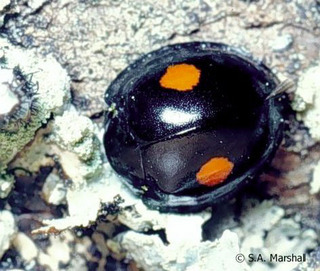
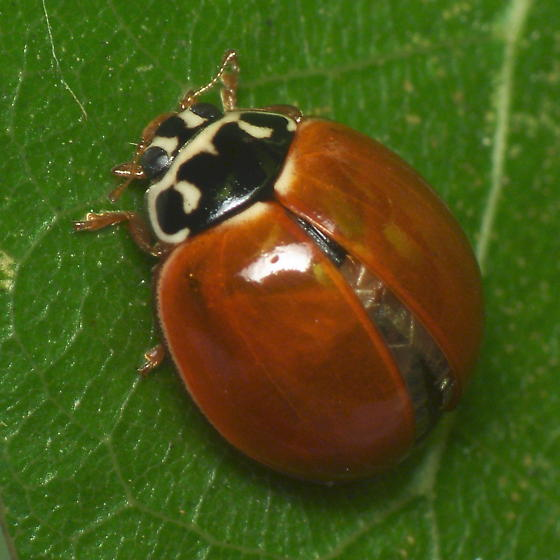
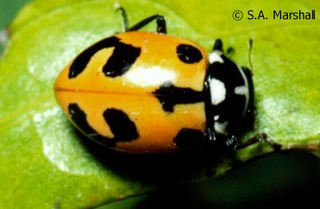
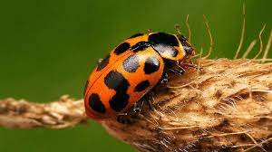
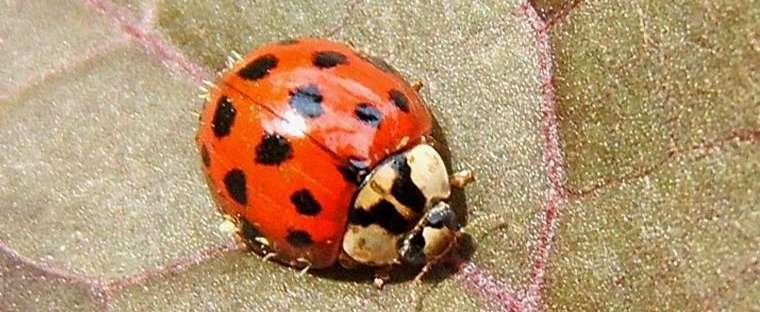

# Project Info

**Date**: April 6th, 2021

**Group members:**

Amanda Zacharias (20043354)

Arjun Augustine (20060723)

Alexander Row (20067626)

Yudong Liu (20020036)

Cameron MacPhail (20012451)

## Dataset Description 
  The original dataset selected was published by [Bahlai et al. (2014)](https://link-springer-com.proxy.queensu.ca/article/10.1007/s10530-014-0772-4#Sec2) and used data from a multi-year study conducted on a ladybeetle (Coccinellidae) community in southwestern Michigan. The study aimed to elucidate the mechanism behind the decline of native Coccinellidae species and generate potential conservation strategies. 
  Data were collected in southern Michigan on an experimental farm and forest area. Forest sampling began in 1993, so data before this time does not include the forest community classification. Adult coccinellids were captured using un-baited yellow sticky pads suspended in the air. As this sampling technique may be more efficient in some habitats than other habitats, we will focus our analysis within habitat types to minimize bias. The time period covered by this dataset includes several important ecological events, including the introduction of non-native competitors (alien coccinellid species) and prey (soybean aphids).
	The first, second and third variables describe collection dates in the form of year; day, month and year (DD-Month-YYYY); and ordinal day of the year, respectively. The fourth variable describes how the plot was managed (e.g. conventional tilling, organic, etc.), if at all. The fifth variable records the habitat type (i.e. the plant community growing in the plot). This differs from the management treatment due to crop rotation. The sixth variable is the plant community classification (annual, perennial, or forest). The seventh variable is the plot replicate number. The eighth variable is the sample station number; there are five stations per plot. The ninth variable is the species ID; there are 13 species in total. Finally, the tenth variable describes the total number of adults captured in a subsample during a week. See Table 1 for a better understanding of the variables within the dataset.
	Bahlai et al. (2014) concluded that the decreasing abundance of native Coccinellidae species was due to competitive exploitation driven by dietary overlap with alien Coccinellidae species. Our project will examine whether seasonal niche partitioning is occurring among and between native and non-native coccinellids.
	
There are 13 species of Ladybeetle documented in this study. 9 species are native, while the remaining 4 are non-native invase species. 
## Native species

1. Two Spot ladybird - Adalia bipunctata


2. Spotted Lady Beetle - Coleomegilla maculata 


3. Twice stabbed ladybug - Chilocorus stigma


4. Three-banded ladybeetle - Coccinella trifasciata


5. Polished/spotless ladybeetle - Cycloneda munda


6. Convergent ladybeetle - Hippodamia convergens


7. Glacial ladybeetle - Hippodamia glacialis


8. Parenthesis ladybeetle - Hippodamia parenthesis


9. Thirteen-spot ladybeetle - Hippodamia tredecimpunctata



## Non-native Invasive Species

1. Seven-spot ladybeetle - Coccinella septempunctata


2. Harlequin/Asian ladybeetle - Harmonia axyridis


3. Variegated ladybeetle - Hippodamia variegata


4. 14-spotted ladybeetle - Propylea quatuordecimpunctata


**We seek to address the following questions:**

1. Within sampling years, does native and non-native species abundance change according to the month?

2. Is there temporal niche partitioning among native species and among non-native species? Is there temporal niche partitioning between native and non-native species?

3. Is there a change in seasonal partitioning before and after invasive species arrive?


[GitHub Repository Link](https://github.com/alexrow15/BIOL432.GroupProject)

## Load Required Packages
```{r message=F}
library(dplyr)
library(tidyr)
library(ggplot2)
library(vegan)
library(reshape2)
library(ape)
library(ggtree)
```

## Load Dataset
```{r}
LadyBugData <- read.csv("BIOL432.Data.GroupProject.csv")
```

## Visualise Raw Data
```{r}
head(LadyBugData)
```

```{r}
tail(LadyBugData)
```

```{r}
summary(LadyBugData) #view summary for each variable in dataset
```


# Is there temporal niche partitioning among native species and among non-native species? Is there temporal niche partitioning between native and non-native species?

## Make plots to cluster the species by similarity in their presence/absence by DOY.

Note that this does not tell us if the species partition resources 'seasonally', but it should tell us if there is any temporal partitioning between species or between natives and non-natives by DOY.

I initially used presence/absence instead of abundance, and then tried abundance.

- I figured that because Non-native species are so much more abundant than native species in general, clusters in the analysis might just reflect this difference in abundance. I think presence/absence should give us a better idea of differences between species in terms of their occurence throughout the year.

- Still, it's worth noting that the traps are more likely to catch the most abundant species, so the plots will still be biased towards finding differences between abundant and non-abundant species.

### Create a function to use Regex coding to change speciesID into scientific name 
```{r}
changeID <- function(dataframe, speciesIDCode, SpeciesName, column){
  dataframe$SpeciesID <- gsub(speciesIDCode, SpeciesName,dataframe$SpeciesID)
  return(dataframe)
}
```

## Change all speciesID names
```{r}
#ABIPN 
LadyBugData <- changeID(LadyBugData, "ABIPN", "A. bipunctata")
#CMAC
LadyBugData <- changeID(LadyBugData, "CMAC", "C. maculata")
#CSTIG
LadyBugData <- changeID(LadyBugData, "CSTIG", "C. stigma")
#CTRIF
LadyBugData <- changeID(LadyBugData, "CTRIF", "C. trifasciata")
#CMUND
LadyBugData <- changeID(LadyBugData, "CMUND", "C. munda")
#HCONV
LadyBugData <- changeID(LadyBugData, "HCONV", "H. convergens")
#HGLAC
LadyBugData <- changeID(LadyBugData, "HGLAC", "H. glacialis")
#HPARN
LadyBugData <- changeID(LadyBugData, "HPARN", "H. parenthesis")
#HTRE
LadyBugData <- changeID(LadyBugData, "HTRE", "H. tredecimpunctata")
#CSEPT
LadyBugData <- changeID(LadyBugData, "CSEPT", "C. septempunctata")
#HAXY
LadyBugData <- changeID(LadyBugData, "HAXY", "H. axyridis")
#HVAR
LadyBugData <- changeID(LadyBugData, "HVAR", "H. variegata")
#PQUA
LadyBugData <- changeID(LadyBugData, "PQUA", "P. quatuordecimpunctata")
```

##### Make sure to subset by invasion period and aphid outbreak period later


### Make a data.frame indicating the native/non-native status of each species

Will need this to compare native and non-native species

```{r}
SpeciesID <- unique(LadyBugData$SpeciesID)
Native <- c("Y", "N", "Y", "Y", "Y", "Y", "Y", "N", "Y", "Y", "Y", "N", "N")

SpeciesOrigin <- data.frame(SpeciesID, Native)
```

### Plot histograms of the count data

```{r}
# Plot counts for the raw abundance data (for each observation)
ggplot(LadyBugData, aes(x=Adults, y=..count..))+
  geom_histogram()
```
There is a wide range in abundances. From Cameron's graphs, non-native species are much more abundant than native species. To get an idea of how often each species is represented in the dataset:
```{r}
# Sum up the DOY abundnaces for each species
LadyBugData %>% group_by(SpeciesID) %>% summarise(totalAbun = sum(Adults, na.rm = TRUE))
```
#Certain species are indeed far more common in the dataset than others.

See how the distribution of abundances looks with log transformations:
```{r}
# In the decostand function log is the logarithm function suggested by Anderson, M.J., Ellingsen, K.E. & McArdle, B.H. (2006) Multivariate dispersion as a measure of beta diversity. Ecology Letters 9, 683–693: It applies log_b(x) + 1 where x > 0. b is the base of the logarithm. Higher bases give less weight to more abundant species and let rare species have more influence. (see documentation)

# Try log base 1
ggplot(LadyBugData, aes(x=decostand(LadyBugData$Adults, method = "log", logbase = 2, na.rm = T)), y=..count..)+
  geom_histogram() +
  scale_x_continuous(name = "log2(Adults)")

# Try log base 5
ggplot(LadyBugData, aes(x=decostand(LadyBugData$Adults, method = "log", logbase = 5, na.rm = T)), y=..count..)+
  geom_histogram() +
  scale_x_continuous(name = "log5(Adults)")

# Try log base 10
ggplot(LadyBugData, aes(x=decostand(LadyBugData$Adults, method = "log", logbase = 10, na.rm = T)), y=..count..)+
  geom_histogram() +
  scale_x_continuous(name = "log10(Adults)")

# Try log base 50
ggplot(LadyBugData, aes(x=decostand(LadyBugData$Adults, method = "log", logbase = 50, na.rm = T)), y=..count..)+
  geom_histogram() +
  scale_x_continuous(name = "log50(Adults)")

# log base = Inf scales the data to pure presence/absence in the decostand function
ggplot(LadyBugData, aes(x=decostand(LadyBugData$Adults, method = "log", logbase = Inf, na.rm = T)), y=..count..)+
  geom_histogram() +
  scale_x_continuous(name = "log.Inf(Adults)")
```

For now let's try a log10 transformation of the abundance data. It should be pretty easy to switch between the transformations though.

### Try clustering the abundance data using distance matrices and neighbor-joining trees

#### Try abundance data instead:
```{r}
# Log transform the abundance data using decostand? from the vegan package
logTLadyBug <- LadyBugData
logTLadyBug <- LadyBugData %>%
  mutate(logTAdults = decostand(LadyBugData$Adults, method = "log", 
                                logbase = 10, na.rm = T)) %>%  # transform with log10
  select(-Adults) # Replace Adults with logTAdults

# Could add a step here to split the dataset into subsets for relevant time periods. Would have to do the following steps separately for each time period.

# Pool the abundance data for station, plot, treatment, across the years within groups of DOY + SpeciesID + TYPE
datAbunSum <- logTLadyBug %>% group_by(DOY, SpeciesID, TYPE) %>% summarize(SumAbun = sum(logTAdults, na.rm = T))

# Make matrices of species abundances where the rows are the individual species and the columns are days of the year (DOY) for each habitat type

# For forest habitat:
forest.specDOY <- datAbunSum %>% filter(TYPE == "forest") %>% 
  pivot_wider(names_from = DOY, values_from = SumAbun) # Rearrange data.frame so abundance data is arranged as separate DOY columns

forest.specDOY <- data.frame(forest.specDOY) # Convert from grouped data to a regular data.frame object

row.names(forest.specDOY) <- forest.specDOY$SpeciesID

forest.specDOY <- data.frame(forest.specDOY) %>% select(-SpeciesID, -TYPE) # Remove speciesID and habitat type from dataset so dist() can be run on it
```


```{r}
# Make distance matrix
forest.dist <- vegdist(forest.specDOY, method = "bray", na.rm = TRUE) # For now try bray-curtis dissimilarity. Will later try to find alternate distance of dissimilarity metrics in vegdist that control for biases caused by excessive abundance in particular species

# Display distance matrix with white representing no difference in temporal abundance between species and red representing the highest pairwise distance between species
PFdat <- melt(as.matrix(forest.dist))
ggplot(data = PFdat, aes(x=Var1, y=Var2, fill = value)) +
  geom_tile() +
  scale_fill_gradientn(colours=c("white","blue","green","red")) +
  theme(axis.text.x = element_text(angle = 90, hjust = 1, vjust = 0.5))
```
With log10 transformation all the species are really distinct from each other.
This makes sense because taking differences in abundance into account should amplify the differences between species relative to just presence/absence.

The distance between HTRE and HCONV seems undefined. Let's see how well represented they are in the forest subset:
```{r}
# Sum up the DOY abundnaces for each species
rowSums(forest.specDOY, na.rm=T)
```
HCONV and HTRE both have 0 observations. I think this results in undefined bray-curtis dissimilarity values. Undefined values do not occur when you switch the distance metric to 'euclidean', however 'euclidean' does not distinguish among the species as well. Also switching to euclidean doesn't seem to affect the topology of the tree much but the branch lengths become very uneven.


```{r fig.height=8, fig.width=8}
# Make Neighbor-joining tree
forest.tree <- njs(forest.dist) # njs allows for missing values in the distance matrix

ggtree(forest.tree, layout = "rectangular") %<+% SpeciesOrigin +
  geom_tiplab(aes(colour = Native)) +
  theme(legend.position = "right")
```
Some notes about what happened when I tried switching log transformations:

- log10 and log50 transformations gave identical trees
- Switching from log10 to log.Inf (presence/absence) barely changed the topology, and the relationships between the non-native species remained the same.
- Switching from log10 to log2 barely changed the tree
- log2 transformation and raw abundance data gave identical trees


Tried using NMDS (it doesn't work if you set distance method to bray-curtis dissimilarity)
```{r}
forest.dist <- vegdist(forest.specDOY, method = "euclidean", na.rm = TRUE)
set.seed(21)
forest.NMDS <- metaMDS(forest.dist, k=2) # k = 2 dimensions

forest.NMDSdat <-data.frame(NMDS1 = forest.NMDS$points[,1],
                            NMDS2 = forest.NMDS$points[,2],
                            SpeciesID = row.names(forest.specDOY))
```

metaMDS() returns the warning: 'stress is (nearly) zero: you may have insufficient data'. Try plotting it anyways to see what it looks like.

```{r}
ggplot(data = forest.NMDSdat, aes(x = NMDS1, y = NMDS2)) +
  geom_point(size = 3, alpha = 0.6) +
  theme_bw()
```

```{r}
# To get a better look at most of the species remove HAXY (which has really high abundance in the forest subset relative to the other species - see above) from the plot
forest.NMDSdat2 <- forest.NMDSdat %>% filter(SpeciesID != "HAXY")
ggplot(data = forest.NMDSdat2, aes(x = NMDS1, y = NMDS2)) +
  geom_point(size = 3, alpha = 0.6) +
  theme_bw()
```

It seems like the NMDS coordinates have really small variation compared to the plots from tutorials and assignments. I wonder if it might have to do with the relatively small number of pairwise comparisons made in the distance matrix (13x13=169) - at least that's my best guess from googling.

Also, the bottom of the documentation page for metaMDS() (under 'Note') says that the default values for the metaMDS function are designed for use with community data (which I assume would mean having species compositions in the rows of the dataset that the distance matrix is built from instead of DOY abundances as I have it here). So regardless of the above point it's probably best not to run NMDS on the dataset as I have it set up above.

So there's 3 options (that I can think of anyways):

1. Try a PCoA plot to cluster the data instead (seemed to be suggested when I tried googling the warning "stress is (nearly) zero: you may have insufficient data"). If we do this, it'll be good to say why we didn't use NMDS. Downside is that we didn't cover it in class, so the prof and TAs might not like that?

###### I think our way around this is to leave the current NMDS plots and code in our report and just dont run it - that way we can show we tried it but after research found a better fit method. 

2. Just cluster the data based off trees (probably easiest).

3. If we still want to do NMDS: Build a distance matrix from a dataset more similar to what we did in class, with species compositions across the columns instead of DOY abundances. *The only issue is that we wouldn't be able to colour the tree or NMDS plot by native vs non-native* because we wouldn't be comparing individual species for differences in abundance patterns, instead each row in the dataset would represent species composition (which can't be classified as native or non-native). So it wouldn't tell us if there's temporal partitioning by DOY between species or native and non-native species, it would only tell us if there different times of year have distinct species compositions.

If we do option 3 we need to decide what each row should be:

- One option is to have each row be DOY (then colour by month or a gradient from low to high DOY so we can more easilly see how different parts of the year cluster or if the DOY species compositions seem randomly dispersed).


I also tried doing the above analysis by summing abundance for each day of each year instead of each day across the years:
```{r}
# Log transform the abundance data using decostand? from the vegan package
logTLadyBug <- LadyBugData
logTLadyBug <- LadyBugData %>%
  mutate(logTAdults = decostand(LadyBugData$Adults, method = "log", 
                                logbase = 10, na.rm = T)) %>%  # transform with log10
  select(-Adults) # Replace Adults with logTAdults

# Could add a step here to split the dataset into subsets for relevant time periods. Would have to do the following steps separately for each time period.

# Pool abundance data for each day of each year for each species and for each habitat type

datYrDOY <- logTLadyBug %>%
  mutate(yrDOY = paste(as.factor(Year), as.factor(DOY), sep = ".")) %>% # Create a variable that combines the year and the DOY
  group_by(SpeciesID, TYPE, yrDOY) %>% summarize(SumAbun = sum(logTAdults, na.rm = TRUE)) %>% # Sum the abundances by species, habitat type, and yrDOY (i.e. pooling observations from each station, plot, and treatment within the species + habitat type + yrDOY groups)
  pivot_wider(names_from = yrDOY, values_from = SumAbun) # Rearrange data.frame so abundance data is arranged as separate yrDOY columns

# For each habitat type, make matrices of species abundance where the rows are the individual species and the columns are yrDOY

# For forest habitat:
forest.specYrDOY <- datYrDOY %>% filter(TYPE == "forest")

forest.specYrDOY <- data.frame(forest.specYrDOY) # Convert from grouped data to a regular data.frame object

row.names(forest.specYrDOY) <- forest.specYrDOY$SpeciesID

forest.specYrDOY <- data.frame(forest.specYrDOY) %>% select(-SpeciesID, -TYPE) # Remove speciesID and habitat type from dataset so dist() can be run on it

head(forest.specYrDOY)
```


```{r}
# Make distance matrix
forest.dist <- vegdist(forest.specYrDOY, method = "bray", na.rm = TRUE) # For now try bray-curtis dissimilarity. Will later try to find alternate distance of dissimilarity metrics in vegdist that control for biases caused by excessive abundance in particular species

# Display distance matrix with white representing no difference in temporal abundance between species and red representing the highest pairwise distance between species
PFdat <- melt(as.matrix(forest.dist))
ggplot(data = PFdat, aes(x=Var1, y=Var2, fill = value)) +
  geom_tile() +
  scale_fill_gradientn(colours=c("white","blue","green","red")) +
  theme(axis.text.x = element_text(angle = 90, hjust = 1, vjust = 0.5))
```

More of the comparisons seem undefined now. I don't know why that is.

```{r fig.height=6, fig.width=8}
# Make Neighbor-joining tree
forest.tree <- njs(forest.dist) # njs allows for missing values in the distance matrix

ggtree(forest.tree, layout = "rectangular") %<+% SpeciesOrigin +
  geom_tiplab(aes(colour = Native)) +
  theme(legend.position = "right")
```

> A final note for these tree analyses: I wonder if part of the differences between species on the tree might reflect differences in the dates each species was sampled (i.e if some species only have data recorded for certain parts of the year while other species have data recorded for other parts of the year then maybe the pairwise distances between them partly reflect that?). Perhaps we could do histograms for the distributions of observation dates for the different species to see if there's any major differences.

> To possibily address the above point (not sure if it actully does), I tried replacing the NA values in the forest.specDOY object with 0s using the values_fill argument in the pivot_wider() function, but that didn't change the tree that was based off DOY abundances. However the tree built from YrDOY abundances did have it's topology changed when the NAs were switched to 0, but still there was little change in the overall pattern of Non-native plants being scattered throughout the tree (with only CSEPT and HAXY being reasonably close).

> It might also be worth trying the yrDOY abundance tree with the different log transformations. I don't think I tried but it's 2:00 am lol.

### A plot for demonstration of the custom function
 
```{r}
tempAbundancePlot <- ggplot(dat, aes(x = DOY, y = Adults)) +
  scale_x_continuous(expand = c(0,0)) +
  scale_y_continuous(expand = c(0,0)) +
  geom_smooth() +
  facet_wrap(~ TYPE) +
  theme_bw()
```


## Making A Custom Function

This function will save a plot in a specified file format. File format options are pdf, png, and jpeg. File will be output to a folder called, "Output".

\n

For example: 

+ input: plot = tempAbundancePlot, file_type = .png, directory = "Folder/Filename.png", width = 5, height = 5 
+ output = a .png image of the graph that is named, "graph"

```{r}
outputFigGenerator <- function(plot_code, file_type = 0,
                               directory="Output/name.png",
                               fig.width = 5,
                               fig.height = 5){
  if (file_type == 1){
    pdf(file = directory, width = fig.width,
            height = fig.height)
    plot_code
  }
  if (file_type == 2){
    png(file = directory, width = fig.width,
            height = fig.height)
    plot_code
  }
  if (file_type == 3){
    jpeg(file = directory, width = fig.width,
            height = fig.height)
    plot_code
  }
  dev.off()
}
```

Run the function

```{r}
outputFigGenerator(plot_code = ggplot(dat, aes(x = DOY, y = Adults)) +
  scale_x_continuous(expand = c(0,0)) +
  scale_y_continuous(expand = c(0,0)) +
  geom_smooth() +
  facet_wrap(~ TYPE) +
  theme_bw(), file_type = 2, directory =  "Output/tempAbundancePlot.png", fig.width = 5, fig.height = 5)
```

```{r}
png(file = "Output/tempAbundancePlot.png")
tempAbundancePlot
dev.off()
```


>>>>>>> 0dec02c71f787801344243d5c59c85ebc9822a4d
